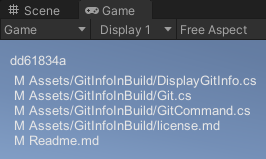

# Git Info In Build

This is a Unity project that fetches git information on build and stores it in resources to be available during runtime.
It is also stored in the streaming assets so its available as .txt files in build files.

When used in the editor, it uses the current state of the git repository.

## Prerequisites

- Git installed and available in system environment path

## Usage

The following properties are available:

- `Git.Hash`: The full hash from commit of this build
- `Git.HashShort`: The first 8 characters of the hash from the commit of this build
- `Git.Status`: A list of all uncommitted or untracked files. An empty string if the git working tree is clean
- `Git.BuildTime`: Returns the build time as UTC "yyyy/MM/dd HH:mm:ss". (From DateTime.UtcNow, not from git commit.)

## Note

If a build fails, the temporary files generated are not deleted as Unity does not have a PostProcess event for failure.
The temporary files will be updated and deleted on the next successful build.

It is recommended to include the following lines in the `.gitignore` file.

- Assets/TempGitInfoInBuild.meta
- Assets/TempGitInfoInBuild/
- Assets/StreamingAssets/GitInfoInBuild.meta
- Assets/StreamingAssets/GitInfoInBuild/
